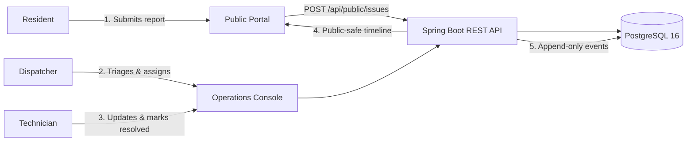

# CivicFlow — Service Operations Platform

[](https://github.com/Oganesian/civicflow/actions/workflows/ci.yml)
[](https://opensource.org/licenses/MIT)
[](https://openjdk.org/)
[](https://spring.io/projects/spring-boot)
[](https://react.dev/)
[](https://www.typescriptlang.org/)

A production-style platform for reporting, triaging, assigning, and resolving municipal service issues. Designed as a clean **modular monolith** with Spring Boot 3, React 18, TypeScript, PostgreSQL, and Spring Security.

> 🛡️ **Demo Disclaimer**: All municipal data, incident locations, and staff profiles in this demo environment are fictional.

---

## 🏛️ System Architecture

CivicFlow features a dual-interface architecture: an unauthenticated **Public Portal** for citizen reporting and transparent status timeline tracking, and an authenticated **Operations Console** for municipal staff dispatchers and field crews.



### Key Technical Highlights
- **Modular Monolith**: Clean package-by-domain architecture (`issues`, `users`, `teams`, `categories`, `audit`, `security`) ensuring ACID consistency and low deployment overhead.
- **Privacy Boundary**: Dedicated DTOs ensure `reporter_email` and internal operational notes are never exposed via public endpoints ([ADR 003](file:///c:/Users/bezim/source/repos/job-hunt/civicflow/docs/adr/003-public-data-boundary.md)).
- **Role-Based Workflows**: Spring Security RBAC protecting Dispatcher, Technician, and Admin operations with JWT and secure HttpOnly cookie support.
- **Append-Only Audit History**: Complete chronological log of state changes, priority adjustments, and team handovers.

---

## 🚀 Quick Start (Local Development)

### Option 1: Docker Compose (All Services)

Start frontend, backend, and PostgreSQL with a single command:

```bash
docker compose up --build
```

- **Frontend Application**: [http://localhost:5173](http://localhost:5173)
- **Backend API**: [http://localhost:8080](http://localhost:8080)
- **OpenAPI / Swagger UI**: [http://localhost:8080/swagger-ui/index.html](http://localhost:8080/swagger-ui/index.html)

---

### Option 2: Running Locally from Source

#### 1. Start PostgreSQL
```bash
docker compose up -d postgres
```

#### 2. Backend (Java 21 / Maven)
```bash
cd backend
./mvnw spring-boot:run
```

#### 3. Frontend (React 18 / Vite)
```bash
cd frontend
npm install
npm run dev
```

---

## 🔑 Demo Personas & Credentials

The web application includes 1-click instant login buttons on `/login`. You can also sign in manually with these credentials:

| Persona | Email | Password | Role & Permissions |
|---|---|---|---|
| **Dispatcher** | `dispatcher@demo.civicflow.app` | `DemoPass!2026` | Triage incoming reports, assign municipal teams, set priorities and SLAs. |
| **Technician (Roads)** | `technician@demo.civicflow.app` | `DemoPass!2026` | View personal/team work queue, add internal notes, resolve incidents. |
| **Administrator** | `admin@demo.civicflow.app` | `DemoPass!2026` | Manage categories, default SLA hours, service teams, and staff accounts. |

---

## 🧪 Testing & Quality Gates

### Backend Tests
```bash
cd backend
./mvnw test
./mvnw verify
```

### Frontend Tests & Typecheck
```bash
cd frontend
npm run typecheck
npm run lint
npm run test:run
npm run build
```

---

## 📂 Repository Structure

```
civicflow/
├── compose.yaml                    # Local multi-container Docker compose setup
├── docs/
│   ├── architecture.md             # System architecture & domain decomposition
│   ├── portfolio-case-study.md     # Detailed case study (English & German)
│   ├── demo-accounts.md            # Demo environment credentials & roles
│   └── adr/                        # Architecture Decision Records (ADRs)
├── backend/
│   ├── Dockerfile
│   ├── pom.xml                     # Maven dependencies & plugins
│   └── src/
│       ├── main/java/com/karenoganesian/civicflow/
│       │   ├── common/             # RFC 9457 ProblemDetail handler, pagination
│       │   ├── config/             # Security, OpenAPI, and CORS configs
│       │   ├── security/           # JWT provider, auth filter, UserPrincipal
│       │   ├── users/              # Users domain, auth controller, admin
│       │   ├── teams/              # Service teams domain & controllers
│       │   ├── categories/         # Categories & SLA management
│       │   ├── issues/             # Issue domain, state machine, controllers
│       │   └── audit/              # Append-only audit events subsystem
│       └── main/resources/
│           ├── application.yml
│           └── db/migration/       # Flyway schema (V1) & seed data (V2)
└── frontend/
    ├── Dockerfile
    ├── package.json
    ├── vite.config.ts
    └── src/
        ├── api/                    # Typed API client & interfaces
        ├── app/                    # Theme, routes, and query client
        ├── auth/                   # React auth context & protected routes
        ├── components/             # Navbar, Footer, StatusChip, SlaBadge, Map
        └── features/
            ├── public/             # Landing, ReportIssue, Explorer, Detail
            ├── operations/         # Dashboard, WorkQueue, Workspace, MyWork
            ├── admin/              # Categories, Teams, Users management
            └── docs/               # In-app architecture case study
```

---

## 📜 License

MIT License — Copyright (c) 2026 Karen Oganesian.
