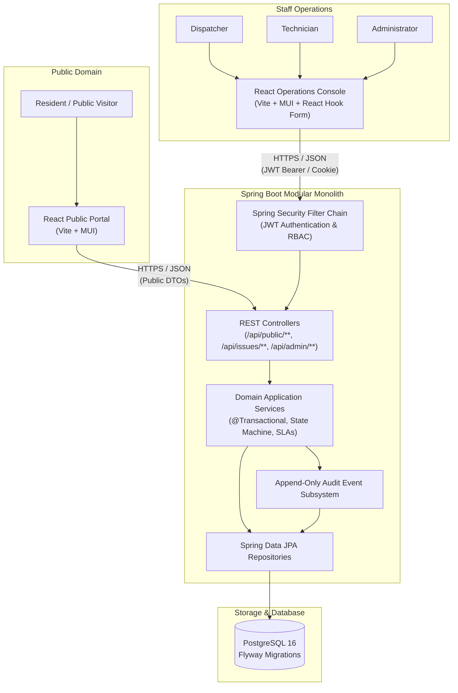

# CivicFlow Architecture Documentation

## 1. System Overview

CivicFlow is built as a **modular monolith** with a decoupled React SPA frontend and a Java 21 / Spring Boot 3 REST API backend. It provides a dual-facing service-operations interface:
1. **Public Portal**: Unauthenticated municipal resident interface to browse public issue statuses, inspect timelines, and submit new service reports.
2. **Operations Console**: Authenticated role-based operational cockpit for dispatchers, field technicians, and administrators to triage, assign, update, and resolve incidents.



---

## 2. Domain Decomposition

The backend code is organized into cohesion-focused domain packages:

```
com.karenoganesian.civicflow
├── common/                  # Global exceptions, RFC 9457 ProblemDetail handlers, pagination
├── config/                  # Web, Security, Jackson, OpenAPI, and CORS configurations
├── security/                # JWT token provider, auth filters, UserPrincipal, RBAC constants
├── users/                   # User entity, repository, authentication services, user management
├── teams/                   # Service teams (Roads, Waste Management, Parks, Street Lighting)
├── categories/              # Issue categories (slugs, SLA targets, public list, admin management)
├── issues/
│   ├── domain/              # Issue entity, IssueStatus enum, Priority enum, state transitions
│   ├── persistence/         # IssueRepository with JPA Specifications (search, filter, sort)
│   ├── application/         # IssueService, IssueAssignmentService, StatusTransitionService
│   ├── api/                 # Public DTOs (sanitized) & Staff DTOs (operational detail)
│   └── web/                 # PublicIssueController, StaffIssueController, MyWorkController, DashboardController
├── audit/                   # Append-only IssueEvent entity, IssueEventType, EventLogger
└── attachments/             # Attachment metadata, MIME verification, visibility checks
```

---

## 3. Issue Lifecycle State Machine

```
               ┌──────────┐
               │   NEW    │
               └────┬─────┘
                    │
         ┌──────────┴──────────┐
         ▼                     ▼
   ┌───────────┐         ┌────────────┐
   │  TRIAGED  │         │  REJECTED  │ (Terminal)
   └─────┬─────┘         └────────────┘
         │
         ▼
   ┌───────────┐
   │ ASSIGNED  │
   └─────┬─────┘
         │
         ▼
  ┌─────────────┐
  │ IN_PROGRESS │
  └──────┬──────┘
         │
         ▼
   ┌───────────┐
   │ RESOLVED  │
   └─────┬─────┘
         │
         ▼
    ┌────────┐
    │ CLOSED │ (Terminal)
    └────────┘
```

### Transition Invariants:
1. **NEW → TRIAGED / REJECTED**: Only `DISPATCHER` or `ADMIN` may triage or reject.
2. **TRIAGED → ASSIGNED**: Must specify an active `teamId` (and optional `userId` belonging to that team).
3. **ASSIGNED → IN_PROGRESS**: Technician (belonging to the assigned team), Dispatcher, or Admin may start work.
4. **IN_PROGRESS → RESOLVED**: Requires a public message explaining the resolution.
5. **RESOLVED → CLOSED**: Final administrative closure after verification.
6. Every transition writes an append-only `issue_events` record with previous/new state, actor ID, and timestamp.

---

## 4. Privacy & Public Data Boundary

To prevent accidental data leakage:
- Public endpoints return dedicated `PublicIssueResponse` objects. Database entities (`Issue`, `User`, etc.) are never serialized directly to public consumers.
- `reporter_email` is strictly private and never returned in any public endpoint.
- Internal staff comments (`visibility = 'INTERNAL'`) are filtered at the repository/service layer before constructing public responses.
- Internal audit events (e.g. internal assignments or staff notes) are omitted from public timelines.
