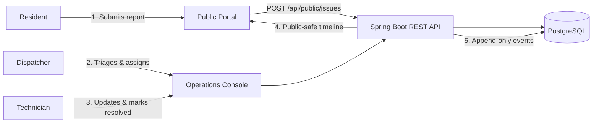

# CivicFlow — Service Operations Platform Case Study

## 1. Executive Summary

**CivicFlow** is a portfolio-grade full-stack platform designed to manage municipal service operations. It provides an unauthenticated citizen portal for reporting public incidents (such as road damage, malfunctioning street lights, and park hazards) and an authenticated operations console for dispatchers and field crews to triage, assign, and resolve issues under strict SLAs with an immutable audit log.



---

## 2. Technical Decisions & ADR Highlights

### A. Modular Monolith Architecture ([ADR 001](file:///c:/Users/bezim/source/repos/job-hunt/civicflow/docs/adr/001-modular-monolith.md))
- **Decision:** Built as a single cohesive Spring Boot backend with domain packages (`issues`, `users`, `teams`, `categories`, `audit`, `security`) and a React SPA.
- **Why:** Avoids premature distributed systems complexity (Kafka, distributed transactions, multi-repo overhead) while maintaining clean domain boundaries and atomic ACID transactions.

### B. Role-Based Access Control & Security ([ADR 002](file:///c:/Users/bezim/source/repos/job-hunt/civicflow/docs/adr/002-demo-authentication.md))
- **Decision:** BCrypt password hashing, signed HMAC-SHA256 JWT tokens, and method-level `@PreAuthorize` guards.
- **Roles:**
  - `DISPATCHER`: Triages incoming reports, assigns teams, manages priorities and SLAs.
  - `TECHNICIAN`: Works on incidents assigned to their specific municipal team, posts progress notes, and resolves work.
  - `ADMIN`: Manages categories, default SLA hours, municipal teams, and staff accounts.
  - `RESIDENT`: Public citizen tracking.

### C. Public Data Boundary & Privacy ([ADR 003](file:///c:/Users/bezim/source/repos/job-hunt/civicflow/docs/adr/003-public-data-boundary.md))
- **Decision:** Dedicated DTO mapping prevents internal database entities from ever reaching the public HTTP layer.
- **Zero Leak Guarantee:**
  - `reporter_email` is optional, strictly confidential, and excluded from all public responses.
  - Comments carry `PUBLIC` vs `INTERNAL` visibility; internal staff notes are excluded from citizen timelines.
  - Tracking uses human-readable reference codes (e.g. `CF-2026-00101`) rather than internal database UUIDs.

---

## 3. Issue Lifecycle State Machine

```
               ┌──────────┐
               │   NEW    │
               └────┬─────┘
                    │
         ┌──────────┴──────────┐
         ▼                     ▼
   ┌───────────┐         ┌────────────┐
   │  TRIAGED  │         │  REJECTED  │ (Terminal)
   └─────┬─────┘         └────────────┘
         │
         ▼
   ┌───────────┐
   │ ASSIGNED  │
   └─────┬─────┘
         │
         ▼
  ┌─────────────┐
  │ IN_PROGRESS │
  └──────┬──────┘
         │
         ▼
   ┌───────────┐
   │ RESOLVED  │
   └─────┬─────┘
         │
         ▼
    ┌────────┐
    │ CLOSED │ (Terminal)
    └────────┘
```

---

## 4. Portfolio Cards

### English Entry

**CivicFlow — Service Operations Platform**
> A production-style platform for reporting, triaging, and resolving public-service issues. I designed and built the complete workflow: a React operations console, a Spring Boot API, role-based access control, PostgreSQL persistence, audit history, automated tests, containerised local development, and a live demo with fictional data.

`React · TypeScript · Java 21 · Spring Boot · PostgreSQL · Spring Security · Docker · GitHub Actions`

---

### German Entry

**CivicFlow — Plattform für Service-Operations**
> Eine produktionsnahe Plattform zum Melden, Priorisieren und Bearbeiten kommunaler Anliegen. Ich habe den vollständigen Workflow umgesetzt: React-Operations-Console, Spring-Boot-API, rollenbasierte Zugriffskontrolle, PostgreSQL-Persistenz, Audit-Historie, automatisierte Tests, containerisierte lokale Umgebung und eine Live-Demo mit fiktiven Daten.

`React · TypeScript · Java 21 · Spring Boot · PostgreSQL · Spring Security · Docker · GitHub Actions`
